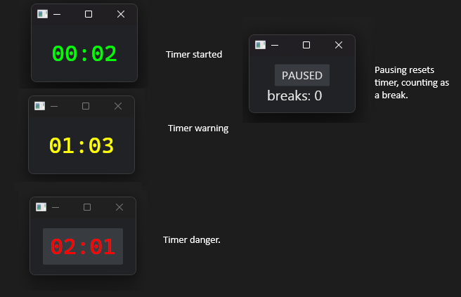

# Stopwatch

Very simple GUI stopwatch

Built mostly to track how long I've been doing one activity to switch things up.
Colours yellow when a break is due, and red when you really should take one.

Configurable via a TOML file in your `$XDG_CONFIG_DIR`.

## Installation

Add as software:
- `cargo install zarthus_stopwatch`

## Contributing

Contributions are welcome! Feel free to open an issue or submit a pull request.

## License

Licensed under the following licenses at your option:

- Apache License, Version 2.0 <[LICENSE-APACHE](LICENSE-APACHE) or https://www.apache.org/licenses/LICENSE-2.0>
- MIT license <[LICENSE-MIT](LICENSE-MIT) or https://opensource.org/licenses/MIT>

Files in the project may not be copied, modified, or distributed except according to those terms.
